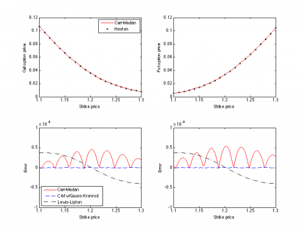

[](http://quantlet.de/)

## [](http://quantlet.de/) **STFhes03** [](http://quantlet.de/)

```yaml

Name of QuantLet: STFhes03

Published in: Statistical Tools for Finance and Insurance

Description: 'Compares the option prices obtained using the analytical Heston formula (1993) and the FFT method (Carr-Madan formula via FFT + Simpson"s, Carr-Madan using adaptive Gauss-Kronrod quadrature, and Lipton"s formula using adaptive Gauss-Kronrod quadrature). Requires HestonFFTVanilla.m, HestonVanillaLipton.m and HestonVanilla.m function.'

Keywords: heston, geometric-brownian-motion, option-price, visualization, graphical representation, Gauss Kronrod, strike, error

See also: HestonFFTVanilla, HestonVanilla, HestonVanillaLipton

Author: Rafal Weron, Agnieszka Janek

Submitted: Tue, September 18 2012 by Dedy Dwi Prastyo

Example: 'HestonFFTVanilla.m, HestonVanillaLipton.m, HestonVanilla.m produce these plots.'
```



### MATLAB Code
```matlab

% clear variables and close windows
clear all
close all
clc


standalone = 0; % set to 0 to make plots as seen in STF2

% Sample input:
S = 1.2;
T = 0.5;
r = 0.022;
rf = 0.018;
kappa = 1.5;  % speed of mean revision of the volatility process
theta = 0.015; % long-term mean of volatility process
sigma = 0.2; % volatility
rho = 0.05; % correlation between the spot price and volatility processes
v0 = 0.01;
K = 1.1:.0025:1.3;

t1=zeros(1,length(K));
t2=zeros(1,length(K));
t3=zeros(1,length(K));
t4=zeros(1,length(K));
t5=zeros(1,length(K));
t6=zeros(1,length(K));
t7=zeros(1,length(K));
t8=zeros(1,length(K));

timegk = 0;
timecm = 0;
timelip = 0;
timehes = 0;


%Calculate the option prices 
for i=1:length(K)
    tic
    t1(i) = HestonFFTVanilla(1,S,K(i),T,r,rf,kappa,theta,sigma,rho,v0,0.75,0); % Gauss-Kronrod quadrature
    timegk = timegk + toc;
    tic
    t2(i) = HestonFFTVanilla(1,S,K(i),T,r,rf,kappa,theta,sigma,rho,v0,0.75,1); % FFT + Simpson's rule
    timecm = timecm + toc;
    tic
    t3(i) = HestonVanillaLipton(1,S,K(i),T,r,rf,kappa,theta,sigma,rho,v0);
    timelip = timelip + toc;
    tic
    t4(i) = HestonVanilla(1,S,K(i),v0,sigma,r,rf,T,kappa,theta,0,rho);
    timehes = timehes + toc;
    
    t5(i) = HestonFFTVanilla(-1,S,K(i),T,r,rf,kappa,theta,sigma,rho,v0,0.75,0); % Gauss-Kronrod quadrature
    t6(i) = HestonFFTVanilla(-1,S,K(i),T,r,rf,kappa,theta,sigma,rho,v0,0.75,1); % FFT + Simpson's rule
    t7(i) = HestonVanillaLipton(-1,S,K(i),T,r,rf,kappa,theta,sigma,rho,v0);
    t8(i) = HestonVanilla(-1,S,K(i),v0,sigma,r,rf,T,kappa,theta,0,rho);
end

% Compare mean CPU times
disp('Mean CPU times:')
disp(['G-K quad:   ' num2str(mean(timegk))])
disp(['Carr-Madan: ' num2str(mean(timecm))])
disp(['Lipton:     ' num2str(mean(timelip))])
disp(['Heston:     ' num2str(mean(timehes))])

figure (1)
% Call options
subplot(2,2,1)
plot(K,t2,'r','LineWidth',1);
hold on
plot (K(1:4:end),t4(1:4:end),'k+','MarkerSize',5);
hold off  
if standalone, title('Call prices in the Heston model'); end
legend('Carr-Madan','Heston')
xlabel ('Strike price');
ylabel ('Call option price');
set(gca,'XLim',[1.1 1.3],'YLim',[0 .12+eps]);

% Put options
subplot(2,2,2)
plot(K,t6,'r','LineWidth',1);
hold on
plot (K(1:4:end),t8(1:4:end),'k+','MarkerSize',5);
hold off  
if standalone, title('Put prices in the Heston model'); end
xlabel ('Strike price');
ylabel ('Put option price');
set(gca,'XLim',[1.1 1.3],'YLim',[0 .12+eps]);

% Errors wrt Heston
subplot(2,2,3)
plot(K,(t2-t4),'r-',K,(t1-t4),'b--',K,(t3-t4),'k-.','LineWidth',1);
if standalone, title('FFT - Heston'); end
xlabel ('Strike price');
ylabel ('Error');
legend('Carr-Madan','C-M w/Gauss-Kronrod','Lewis-Lipton',3)
set(gca,'XLim',[1.1 1.3],'YLim',[-1 1]*1e-3);

subplot(2,2,4)
plot(K,(t6-t8),'r-',K,(t5-t8),'b--',K,(t7-t8),'k-.','LineWidth',1);
if standalone, title('FFT - Heston'); end
xlabel ('Strike price');
ylabel ('Error');
set(gca,'XLim',[1.1 1.3],'YLim',[-1 1]*1e-3);

if standalone,
    figure(2)
    subplot(1,2,1)
    plot(K,100*(t2-t4)./t4,'r-',K,100*(t1-t4)./t4,'b--',K,100*(t3-t4)./t4,'k-.','LineWidth',1);
    if standalone, title('(FFT - Heston)/Heston'); end
    xlabel ('Strike price');
    ylabel ('Error [%]');
    set(gca,'XLim',[1.1 1.3],'YLim',[-2 3.5+eps]);

    subplot(1,2,2)
    plot(K,100*(t6-t8)./t8,'r-',K,100*(t5-t8)./t8,'b--',K,100*(t7-t8)./t8,'k-.','LineWidth',1);
    if standalone, title('(FFT - Heston)/Heston'); end
    xlabel ('Strike price');
    ylabel ('Error [%]');
    legend('Carr-Madan','C-M w/Gauss-Kronrod','Lewis-Lipton')
    set(gca,'XLim',[1.1 1.3],'YLim',[-1 4+eps]);
end


```

automatically created on 2018-05-28