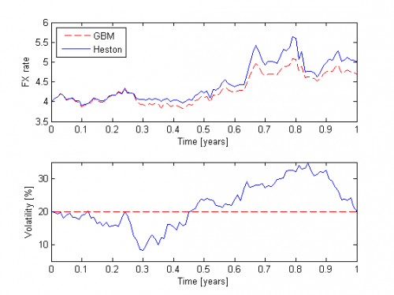

[](http://quantlet.de/)

## [](http://quantlet.de/) **STFhes01** [](http://quantlet.de/)

```yaml

Name of QuantLet: STFhes01

Published in: Statistical Tools for Finance and Insurance

Description: 'Creates plots of the GBM, Heston spot and Heston volatility processes.'

Keywords: 'heston, simulation, geometric-brownian-motion, visualization, graphical representation, wiener-process, volatility'

See also: SFSbb, simGBM, simHeston

Author: Rafal Weron

Submitted: Tue, September 18 2012 by Dedy Dwi Prastyo

Input: 'SIGMA- volatility
	RHO- correlation between the spot price and volatility processes
	KAPPA- speed of mean reversion of the volatility process
	N- time endpoint
	delta- time step size
	THETA- long-term mean of the volatility process'

Output: GBM and Heston dynamics

Example: 'User inputs the SFEWienerProcess parameters as sample input spot = 4 mu = .02 kappa = 2 theta = .04 sigma = .3 rho = -.05 days = 100 time = (0:days)/days STATE = [3621423255; 1292471671] randn("state",STATE) no = normrnd(0,1,length(time)-1,2); needed supplied functions are simGBM, simHeston.'
```



### MATLAB Code
```matlab

% Remove variables and close windows
clear all;
close all,
clc;

% STF2hes01 Plots of GBM, Heston spot and Heston volatility processes  


standalone = 0; % set to 0 to make plots as seen in STF2

% Sample input
spot = 4; 
mu = .02;
kappa = 2;
theta = .04;
sigma = .3;
rho = -.05;

days = 100;
time = (0:days)/days;

STATE = [3621423255; 1292471671];
randn('state',STATE);

% normally distributed random numbers for GBM and Heston processes
no = normrnd(0,1,length(time)-1,2);

% GBM
y = simGBM(1,spot,mu,sqrt(theta),1/days,no(:,1),0);
% Heston spot and volatitlity processes
x = simHeston(1,spot,theta,mu,kappa,theta,sigma,rho,1/days,no,0);

if standalone, 
    figure(1); 
else
    figure(1);
    subplot(2,1,1);
end
plot(time,y,'r--',time,x(:,1),'b','LineWidth',1);
if standalone, title('GBM vs. Heston dynamics'); end
xlabel ('Time [years]');
ylabel ('FX rate');
set(gca,'YLim',[3.5 6]);
legend('GBM','Heston',2)

if standalone, 
    figure(2); 
else
    subplot(2,1,2);
end
plot(time,100*sqrt(x(:,2)),'b',...
    time,zeros(length(time),1) + sqrt(theta)*100,'r--','LineWidth',1);
if standalone, title('GBM vs. Heston volatility'); end
xlabel ('Time [years]');
ylabel ('Volatility [%]');
set(gca,'YLim',[5 35]);


```

automatically created on 2018-05-28