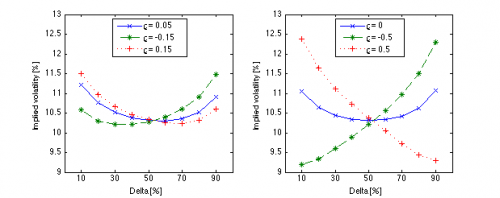

[](http://quantlet.de/)

## [](http://quantlet.de/) **STFhes05** [](http://quantlet.de/)

```yaml

Name of QuantLet: STFhes05

Published in: Statistical Tools for Finance and Insurance

Description: 'Plots the effect of changing the correlation on the shape of the smile. Requires GarmanKohlhagen.m, HestonVanillaSmile.m and HestonVanilla.m function.'

Keywords: correlation, volatility smile, volatility, implied-volatility, heston, model, parameter, graphical representation, visualization

See also: GarmanKohlhagen, HestonVanilla, HestonVanillaSmile

Author: Rafal Weron, Agnieszka Janek

Submitted: Tue, September 18 2012 by Dedy Dwi Prastyo

Example: 'GarmanKohlhagen.m, HestonVanillaSmile.m, HestonVanilla.m produce plots showing the influence of the correlation on the shape of the smile in the Heston model.'
```



### MATLAB Code
```matlab

% clear variables and close windows
clear all
close all
clc

standalone = 0; % set to 0 to make plots as seen in STF2

% market volatilities for respective deltas
delta = .1:.1:.9;
marketvols = [0.1135 0.109 0.10425 0.1025 0.102 0.103 0.10575 0.1105 0.1165];
spot = 1.215; % spot on July 1, 2004
rd = 0.02165; % domestic riskless interest rate
rf = 0.01845; % foreign riskless interest rate
tau = 0.5;    % time to expiry
cp = 1;		  % call option

%Calculate strikes for respective deltas
strikes = GarmanKohlhagen(spot,delta,marketvols,rd,rf,tau,cp,2);

%Sample input:
v0 = 0.01;      % initial volatility
kappa = 1.5;    % speed of mean revision of the volatility process
theta = 0.015;  % long-term mean of volatility process
vv = 0.2;       % volatility
rho = 0.05;     % correlation between the spot price and volatility processes
lambda = 0;

% HestonVanillaSmile returns volatility smile 
smile1 = HestonVanillaSmile(cp,spot,strikes,v0,vv,rd,rf,tau,kappa,theta,lambda,rho);
smile2 = HestonVanillaSmile(cp,spot,strikes,v0,vv,rd,rf,tau,kappa,theta,lambda,-0.15);
smile3 = HestonVanillaSmile(cp,spot,strikes,v0,vv,rd,rf,tau,kappa,theta,lambda,0.15);

smile4 = HestonVanillaSmile(cp,spot,strikes,v0,vv,rd,rf,tau,kappa,theta,lambda,0);
smile5 = HestonVanillaSmile(cp,spot,strikes,v0,vv,rd,rf,tau,kappa,theta,lambda,-0.5);
smile6 = HestonVanillaSmile(cp,spot,strikes,v0,vv,rd,rf,tau,kappa,theta,lambda,0.5);

if standalone, 
    figure(1); 
else
    figure(1);
    subplot(1,2,1);
end
plot(delta*100,smile1*100,'x-',...
    delta*100,smile2*100,'*--',...
    delta*100,smile3*100,'+:','LineWidth',1);
if standalone, title('Correlation and the smile'); end
xlabel ('Delta [%]');
ylabel ('Implied volatility [%]');
legend('rho = 0.05', 'rho = -0.15', 'rho = 0.15','Location','North')
set(gca,'XTick', 10:20:90, 'Ylim', [9 13]);

if standalone, 
    figure(2); 
else
    figure(1);
    subplot(1,2,2);
end
plot(delta*100,smile4*100,'x-',...
    delta*100,smile5*100,'*--',...
    delta*100,smile6*100,'+:','LineWidth',1);
if standalone, title('Correlation and the smile'); end
xlabel ('Delta [%]');
ylabel ('Implied volatility [%]');
legend('rho = 0', 'rho = -0.5', 'rho = 0.5','Location','North')
set(gca,'XTick', 10:20:90, 'Ylim', [9 13]);

```

automatically created on 2018-05-28