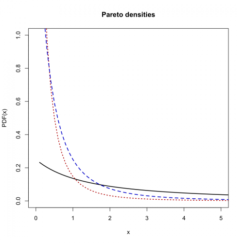
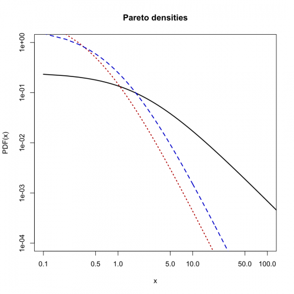
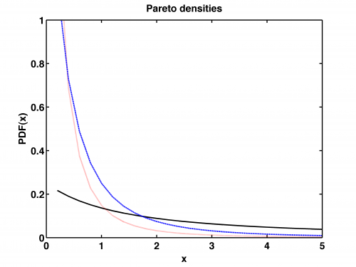
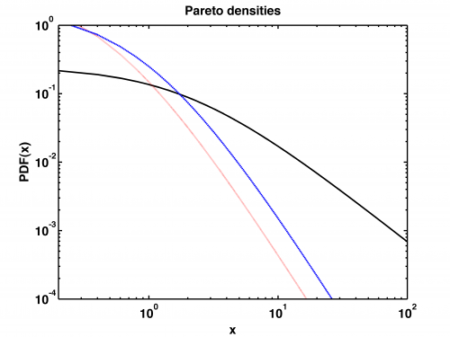

[](http://quantlet.de/)

## [](http://quantlet.de/) **STFloss05** [](http://quantlet.de/)

```yaml

Name of QuantLet: STFloss05

Published in: Statistical Tools for Finance and Insurance

Description: 'Plots three sample Pareto pdfs, Par(alpha, lambda), on linear and double-logarithmic scales. The thick power-law tails of the Pareto distribution (asymptotically linear in the log-log scale) are clearly visible. Requires Paretopdf.m to run the program (see quantnet).'

Keywords: loss function, pareto, pdf, lognormal, graphical representation, visualization

See also: 'Paretopdf, STFloss01, STFloss02, STFloss03, STFloss04, STFloss06, STFloss07, STFloss08, STFloss09, mef'

Author: Joanna Janczura, Awdesch Melzer

Submitted: Tue, October 09 2012 by Dedy Dwi Prastyo

Example: Produces these plots of the Pareto densities


```









### R Code
```r


# clear variables and close windows
rm(list = ls(all = TRUE))
graphics.off()


Paretopdf = function(x, alpha, lambda) {
    # PARETOPDF Pareto probability density function (pdf).  Y = PARETOPDF(X,ALPHA,LAMBDA) returns the pdf of the Pareto
    # distribution with parameters ALPHA, LAMBDA, evaluated at the values in X.  For CONTROL=0 the error message is displayed,
    # if the parmeters are negative.  The default values for ALPHA, LAMBDA are 1, 1 respectively.
    
    if (missing(lambda) == TRUE) {
        lambda = 1
    }
    if (missing(alpha) == TRUE) {
        alpha = 1
    }
    if (missing(x) == TRUE) {
        stop("stats:normpdf:TooFewInputs! Input argument X is undefined.")
    }
    if (lambda <= 0) {
        stop("Non-positive lambda!")
    }
    if (alpha <= 0) {
        stop("Non-positive alpha!")
    }
    x = cbind(x)
    y = matrix(0, dim(x)[1], dim(x)[2])
    pos = x > 0
    y[pos] = alpha * lambda^alpha/(lambda + x[pos])^(alpha + 1)
    return(y)
}

# Pareto densities
step = 10

x = (1:(144 * step))/step
y1 = Paretopdf(x, 0.5, 2)
y2 = Paretopdf(x, 2, 0.5)
y3 = Paretopdf(x, 2, 1)

# linear plot
plot(x, y1, col = "black", type = "l", lwd = 2, xlab = "x", ylab = "PDF(x)", ylim = c(0, 1), xlim = c(0, 5))
title("Pareto densities")
lines(x, y2, col = "red3", lty = 3, lwd = 2)
lines(x, y3, col = "blue3", lty = 2, lwd = 2)

dev.new()
plot(x, y1, log = "xy", col = "black", type = "l", lwd = 2, xlab = "x", ylab = "PDF(x)", ylim = c(1e-04, 1), xlim = c((0.1), 
    (100)))
par(new = T)
plot(x, y2, type = "l", log = "xy", axes = F, frame = F, ylab = "", xlab = "", col = "red3", lty = 3, lwd = 2, ylim = c(1e-04, 
    1), xlim = c((0.1), (100)))
par(new = T)
plot(x, y3, type = "l", log = "xy", axes = F, frame = F, ylab = "", xlab = "", col = "blue3", lty = 2, , lwd = 2, ylim = c(1e-04, 
    1), xlim = c((0.1), (100)))
title("Pareto densities") 

```

automatically created on 2018-05-28

### MATLAB Code
```matlab

clear all
close all
clc

step=5;

x=(1:144*step)/step;
y1=Paretopdf(x,0.5,2);
y2=Paretopdf(x,2,0.5);
y3=Paretopdf(x,2,1);

plot(x,y1,'k','LineWidth',2);
hold on
plot(x,y2,':r','LineWidth',2);
plot(x,y3,'--','LineWidth',2);
xlim([0,5])
xlabel('x','FontSize',16,'FontWeight','Bold');
ylabel('PDF(x)','FontSize',16,'FontWeight','Bold');
title('Pareto densities','FontSize',16,'FontWeight','Bold');
ylim([0 1])
set(gca,'Ytick',[0.0:0.2:1],'YTickLabel',{0.0,0.2,0.4,0.6,0.8,1.0},'FontSize',16,'FontWeight','Bold')
set(gca,'LineWidth',1.6,'FontSize',16,'FontWeight','Bold');
box on
% to save the plot in pdf or png please uncomment next 2 lines:
%print -painters -dpdf -r600 STFloss05_01.pdf
%print -painters -dpng -r600 STFloss05_01.png

figure
loglog(x,y1,'k','LineWidth',2);
hold on
loglog(x,y2,':r','LineWidth',2);
loglog(x,y3,'--','LineWidth',2);
xlim([0 10e1])
ylim([10e-5 10e-1])

xlabel('x','FontSize',16,'FontWeight','Bold');
ylabel('PDF(x)','FontSize',16,'FontWeight','Bold');
title('Pareto densities','FontSize',16,'FontWeight','Bold');

set(gca,'LineWidth',1.6,'FontSize',16,'FontWeight','Bold');
box on

% to save the plot in pdf or png please uncomment next 2 lines:
%print -painters -dpdf -r600 STFloss05_02.pdf
%print -painters -dpng -r600 STFloss05_02.png


```

automatically created on 2018-05-28