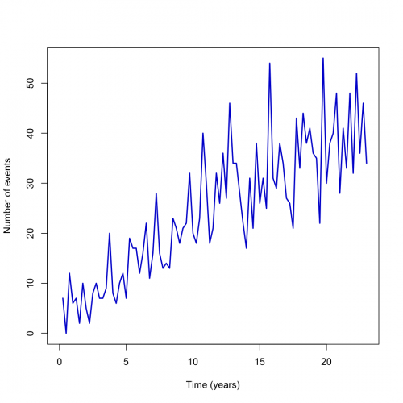
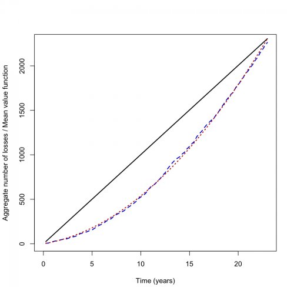
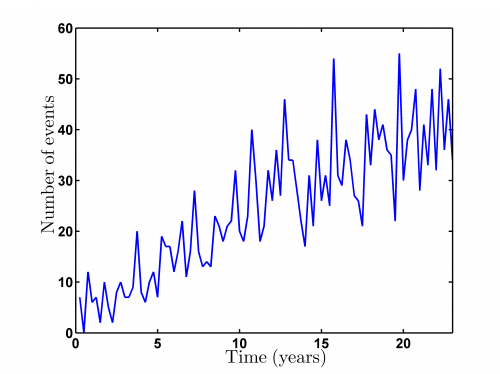
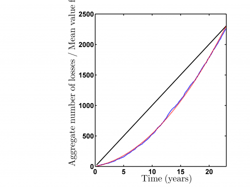

[](http://quantlet.de/)

## [](http://quantlet.de/) **STFloss09** [](http://quantlet.de/)

```yaml

Name of QuantLet: STFloss09

Published in: Statistical Tools for Finance and Insurance

Description: 'Plots the quarterly number of losses for the Danish fire data and the aggregate number of losses and the mean value funtion E(N_t) of the calibrated HPP and NHPP. Clearly the latter model gives a better fit to the data (dfl.dat/ dfl.txt). Requires getQnumber.m from Quantnet website.'

Keywords: pareto, model, loss function, empirical, graphical representation, visualization

See also: 'STFloss01, STFloss02, STFloss03, STFloss04, STFloss05, STFloss06, STFloss07, STFloss08, getQnumber'

Author: Joanna Janczura, Awdesch Melzer

Submitted: Fri, December 07 2012 by Dedy Dwi Prastyo

Datafile: dfl.dat, dfl.txt

Example: 'getQnumber.m produces these plots of the Number of Events and Aggregate number of losses / Mean value function over time.'


```









### R Code
```r


# clear variables and close windows
rm(list = ls(all = TRUE))
graphics.off()

#################################### Subroutine getQnumber(x) #####

getQnumber = function(x) {
    # GETQNUMBER Auxiliary function for STF2loss9 y=getQnumber(x) returns the quarterly number of losses.
    
    maxx = max(x)
    l = length(x)
    y = matrix(0, maxx, 1)
    i = 1
    q = 1
    
    while (i <= l) {
        if (x[i] == q) {
            y[q] = y[q] + 1
            i = i + 1
        } else {
            q = q + 1
        }
    }
    return(y)
}

############################ main calculation #####


m = read.table("dfl.txt")
v = m[which(m[, 5] != 0), 5:6]

n = getQnumber(v[, 2])

# Qnumbers
t = (1:length(n))/4

plot(t, n, type = "l", col = "blue3", lwd = 2, xlab = "Time (years)", ylab = "Number of events", xlim = c(0, 23))

# Mean value function

ncum = cumsum(n)
dev.new()
plot(t, ncum, type = "l", lty = 2, col = "blue3", lwd = 2, xlab = "Time (years)", ylab = "Aggregate number of losses / Mean value function", 
    xlim = c(0, 23))
lines(t, (100.2394 * t), col = "black", lwd = 2)
lines(t, 17.9937 * t + 3.5759 * t^2, col = "red3", lty = 3, lwd = 2) 

```

automatically created on 2018-05-28

### MATLAB Code
```matlab


% clear variables and close windows
clear all
close all
clc


m = load('dfl.dat');
v = m(find(m(:,5)~=0),5:6);

n = getQnumber(v(:,2));

%  Qnumbers
t = (1:length(n))/4;

plot(t,n, 'LineWidth',2);
xlabel('Time (years)','FontSize',16,'FontWeight','Bold');
ylabel('Number of events','FontSize',16,'FontWeight','Bold'); 
xlim([0,23]);
set(gca,'LineWidth',1.6,'FontSize',16,'FontWeight','Bold');
box on

% to save the plot in pdf or png please uncomment next 2 lines:
%print -painters -dpdf -r600 STFloss09_01.pdf
%print -painters -dpng -r600 STFloss09_01.png

%  Mean value function

ncum = cumsum(n);
figure
plot(t,ncum,'--', 'LineWidth',2);
hold on
plot(t,(100.2394*t),'k', 'LineWidth',2);
plot(t,17.9937*t+3.5759*t.^2,'-.r', 'LineWidth',2)
% ylim([0,700])
xlim([0,23]);
xlabel('Time (years)','FontSize',16,'FontWeight','Bold');
ylabel('Aggregate number of losses / Mean value function','FontSize',16,'FontWeight','Bold');

set(gca,'LineWidth',1.6,'FontSize',16,'FontWeight','Bold');
box on

% to save the plot in pdf or png please uncomment next 2 lines:
%print -painters -dpdf -r600 STFloss09_02.pdf
%print -painters -dpng -r600 STFloss09_02.png


```

automatically created on 2018-05-28