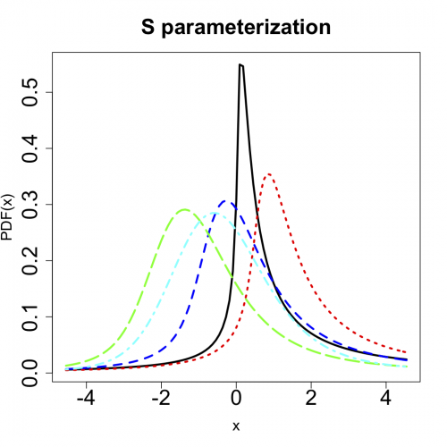
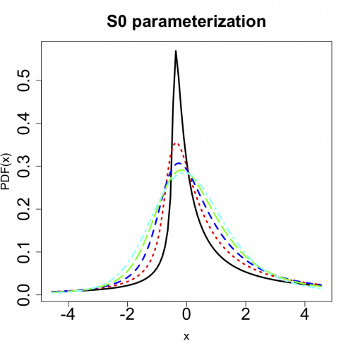
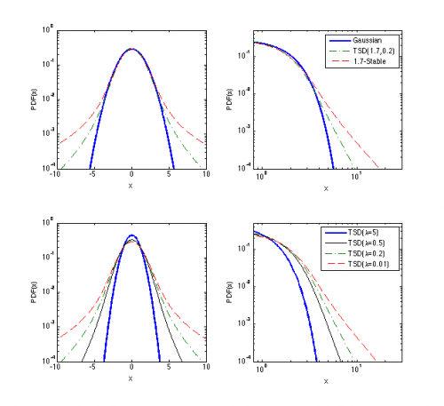

[](http://quantlet.de/)

## [](http://quantlet.de/) **STFstab03** [](http://quantlet.de/)

```yaml

Name of QuantLet: STFstab03

Published in: Statistical Tools for Finance and Insurance

Description: 'STFstab03.R compares S0 and S parameterizations and plots both.
              STFstab03.m shows (top panels) semilog and loglog plots of symmetric 1.7-stable, symmetric tempered stable (TSD) with alpha = 1.7 abd lambda = 0.2, and Gaussian pdfs. Bottom panels show semilog and loglog plots of symmetric TSD pdfs with alpha = 1.7 and four truncation coefficients: lambda = 5, 0.5, 0.2, 0.01. 
              Note, that for large lambdas the distribution approaches the Gaussian (though with a different scale) anf for small lambdas the stable law with the same shape parameter alpha. 
              Requires "stabpdf_fft.m", "tstabpdf.m", and "tstabpdf3.m" functions.'

Keywords: graphical representation, visualization, stable distribution, pdf, simulation

See also: STFstab01, STFstab02, stabpdf_fft, tstabpdf, tstabpdf3

Author: Zografia Anastasiadou, Rafal Weron

Submitted: Tue, September 18 2012 by Dedy Dwi Prastyo

Example: 'STFstab03.R produces the plots of the S and S0 parameterizations.
          stabpdf_fft.m, tstabpdf3.m, tstabpdf.m in STFstab03.m  produce the panel plots.'

```







### R Code
```r

graphics.off()
rm(list = ls(all = TRUE))
# setwd('C:/...')

# install.packages('fBasics') install.packages('stabledist')

library(fBasics)
library(stabledist)
x <- c(-50:50)/11

alpha <- c(0.5, 0.75, 1, 1.25, 1.5)
beta <- 0.5

# S parameterization
w1 <- dstable(x, alpha[1], beta = beta, pm = 1)
w2 <- dstable(x, alpha[2], beta = beta, pm = 1)
w3 <- dstable(x, alpha[3], beta = beta, pm = 1)
w4 <- dstable(x, alpha[4], beta = beta, pm = 1)
w5 <- dstable(x, alpha[5], beta = beta, pm = 1)

plot(x, w1, type = "l", main = "S parameterization", xlab = "x", ylab = "PDF(x)", cex.axis = 2, cex.lab = 1.4, cex.main = 2, 
    lwd = 3)
lines(x, w2, col = "red", lwd = 3, lty = 3)
lines(x, w3, col = "blue", lwd = 3, lty = 2)
lines(x, w4, col = "green", lwd = 3, lty = 5)
lines(x, w5, col = "cyan", lwd = 3, lty = 4)

################################## 

# S0 parameterization
mu2 <- -beta * tan(0.5 * pi * alpha)
mu2[3] = 0

w6 <- dstable(x, alpha[1], beta = beta, pm = mu2[1])
w7 <- dstable(x, alpha[2], beta = beta, pm = mu2[2])
w8 <- dstable(x, alpha[3], beta = beta, pm = mu2[3])
w9 <- dstable(x, alpha[4], beta = beta, pm = mu2[4])
w10 <- dstable(x, alpha[5], beta = beta, pm = mu2[5])
dev.new()
plot(x, w6, type = "l", main = "S0 parameterization", xlab = "x", ylab = "PDF(x)", cex.axis = 2, cex.lab = 1.4, cex.main = 2, 
    lwd = 3)
lines(x, w7, col = "red", lwd = 3, lty = 3)
lines(x, w8, col = "blue", lwd = 3, lty = 2)
lines(x, w9, col = "green", lwd = 3, lty = 5)
lines(x, w10, col = "cyan", lwd = 3, lty = 4) 

```

automatically created on 2018-05-28

### MATLAB Code
```matlab

% clear variables and close windows
clear all
close all
clc


cmd = [1 3];


if ismember(3,cmd),
    f = figure(3);
    subplot(2,2,1)
    [x1,y1] = stabpdf_fft(2,1,0,0,6);
    [x2,y2] = stabpdf_fft(1.7,1,0,0,20);
    x3 = linspace(-20,20,1000);
    y3 = tstabpdf3(x3,1.7,1,.2,0);
    semilogy(x1,y1,'b-','linewidth',2)
    hold on
    semilogy(x3,y3,'-.','color',[0 .5 0],'linewidth',1)
    semilogy(x2,y2,'r--','linewidth',1)
    hold off
    xlabel('x')
    ylabel('PDF(x)')
    set(gca,'xlim',[-10 10],'ylim',[1e-4 1]);

    subplot(2,2,2)
    loglog(x1,y1,'b-','linewidth',2)
    hold on
    loglog(x3,y3,'-.','color',[0 .5 0],'linewidth',1)
    loglog(x2,y2,'r--','linewidth',1)
    hold off
    set(gca,'xlim',[8e-1,3e1],'ylim',[1e-4 .5]);
    xlabel('x')
    ylabel('PDF(x)')
    legend('Gaussian','TSD(1.7,0.2)','1.7-Stable',1)

    subplot(2,2,3)
    y4 = tstabpdf3(x3,1.7,1,5,0);
    y5 = tstabpdf3(x3,1.7,1,.5,0);
    y6 = tstabpdf3(x3,1.7,1,.01,0);
    semilogy(x3,y4,'b-','linewidth',2)
    hold on
    semilogy(x3,y5,'k-','linewidth',1)
    semilogy(x3,y3,'-.','color',[0 .5 0],'linewidth',1)
    semilogy(x3,y6,'r--','linewidth',1)
    hold off
    xlabel('x')
    ylabel('PDF(x)')
    set(gca,'xlim',[-10 10],'ylim',[1e-4 1]);

    subplot(2,2,4)
    loglog(x3,y4,'b-','linewidth',2)
    hold on
    loglog(x3,y5,'k-','linewidth',1)
    loglog(x3,y3,'-.','color',[0 .5 0],'linewidth',1)
    loglog(x3,y6,'r--','linewidth',1)
    hold off
    set(gca,'xlim',[8e-1,3e1],'ylim',[1e-4 .5]);
    xlabel('x')
    ylabel('PDF(x)')
    legend('TSD(lambda=5)','TSD(lambda=0.5)','TSD(lambda=0.2)','TSD(lambda=0.01)',1)
    
    print(f,'-dpsc2','STF2stab03.ps')
end
```

automatically created on 2018-05-28