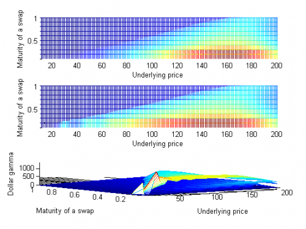

[](http://quantlet.de/)

## [](http://quantlet.de/) **STF2dollargamma3D** [](http://quantlet.de/)

```yaml

Name of QuantLet: STF2dollargamma3D 

Published in: Statistical Tools for Finance and Insurance

Description: 'Calculates the variance vega of equally weighted options" portfolio, weighted by 1/K and by 1/K^2.'

See also: STF2dollargamma2D, STF2vswapstrike

Author: Elena Silyakova

Keywords: gamma, vega, option, portfolio, volatility

Submitted: Mon, December 05 2011 by Dedy Dwi Prastyo

Input: 'n- number of strikes in portfolio
	s2- the highest strike of options" portfolio
	tau_max- maximal maturity of the swap
	s1- the lowest strike of options" portfolio'

Example: '3D plot of individual dollar gammas and portfolio dollar gamma for each weighting scheme.'
```



### MATLAB Code
```matlab

disp('Please input the lowest and the highest strike of options portfolio as: [10,200]') ;
disp(' ') ;
para=input('Options strike range [lower bound, upper bound]=');
while length(para) < 2
  disp('Not enough input arguments. Please input in 1*2 vector form like [10,200] or [10,200]');
  para=input('Options strike range [lower bound, upper bound]=');
end
s1=para(1);
s2=para(2);
disp(' ') ;

disp(' ') ;
disp('Please input the maximal maturity of a swap (e.g. 1 year = 1, 3 month = 0.25)') ;
disp(' ') ;
para=input('Maximal maturity of a swap =');
tau_max=para;


disp(' ') ;
disp('Please input the number of strikes in portfolio (e.g. 10)') ;
disp(' ') ;
para=input('Number of strikes =');
n=para;


% main computation
r=0   ;              % interest rate
v=0.25 ;             % volatility
m=tau_max*10;
tau=0.1:0.1:tau_max;

k=s1:-(s1-s2-1)/n:s2;
range=s2-s1;

for j=1:n %produces gamma "curves" for each strike range    

s_min=max(s1,(k(j)-range));
s_max=min(s2,(k(j)+range));
s=s_min:1:s_max;

for t=1:m

for i=1:length(s)  %produces individual gammas for a given strike but different underlying price 
d1=(log(s(i)/k(j))+(r+v^2/2)*tau(t))/(v*tau(t)^0.5);
o=(j-1)*m+t;
dollargamma(o,i)=(normpdf(d1)*s(i))/(2*v*tau(t)^0.5);
dollargammak(o,i)=(normpdf(d1)*s(i))/(2*k(j)*v*tau(t)^0.5);
dollargammak2(o,i)=(normpdf(d1)*s(i))/(2*k(j)^2*v*tau(t)^0.5);

i=i+1;
end

t=t+1;
end
j=j+1;
end


%calculating dollar gamma of the sum


for b=1:m

i=(b-1)*m+1;
ii=size(dollargamma,1)-m+b;
    
cumdollargamma(b,:)=dollargamma(i,:);    

j=i+m;
for a=(i+m):size(dollargamma,1);
cumdollargamma(b,:)=cumdollargamma(b,:)+dollargamma(a,:);

a=a+m;
end

cumdollargamma(b,:)=3*(max(dollargamma(ii,:))*cumdollargamma(b,:))/max(cumdollargamma(b,:));
b=b+1;

end


for b=1:m

i=(b-1)*m+1;    
ii=size(dollargammak,1)-m+b;
    
cumdollargammak(b,:)=dollargammak(i,:);    

j=i+m;
for a=(i+m):size(dollargammak,1);
cumdollargammak(b,:)=cumdollargammak(b,:)+dollargammak(a,:);

a=a+m;
end

cumdollargammak(b,:)=3*(max(dollargamma(ii,:))*cumdollargammak(b,:))/max(cumdollargammak(b,:));
b=b+1;
end


for b=1:m

i=(b-1)*m+1;    
ii=size(dollargammak2,1)-m+b;
   
cumdollargammak2(b,:)=dollargammak2(i,:);    

j=i+m;
for a=(i+m):size(dollargammak2,1);
cumdollargammak2(b,:)=cumdollargammak2(b,:)+dollargammak2(a,:);

a=a+m;
end

cumdollargammak2(b,:)=3*(max(dollargamma(ii,:))*cumdollargammak2(b,:))/max(cumdollargammak2(b,:));
b=b+1;
end

%plotting


subplot(3,1,1);
x = s1:1:s2; y = 0.1:0.1:tau_max;

[X,Y] = meshgrid(x,y);
axis([s1 s2 0.1 tau_max 0 max(max(cumdollargamma))])
%title('Dollargamma of the options portfolio')
xlabel('Underlying price')
ylabel('Maturity of a swap')
zlabel('Dollar gamma')
hold on


for z=1:n
g=m*(z-1)+1;
c=g+m-1;
mesh(X,Y,dollargamma(g:c,:))
hold on
end
  
mesh(X,Y,cumdollargamma)


subplot(3,1,2);

x = s1:1:s2; y = 0.1:0.1:tau_max;

[X,Y] = meshgrid(x,y);
axis([s1 s2 0.1 tau_max 0 max(max(cumdollargammak))])
%title('Dollargamma of the options portfolio')
xlabel('Underlying price')
ylabel('Maturity of a swap')
zlabel('Dollar gamma')
hold on


for z=1:n
g=m*(z-1)+1;
c=g+m-1;
mesh(X,Y,dollargamma(g:c,:))
hold on
end
    
    
mesh(X,Y,cumdollargammak)


subplot(3,1,3);

x = s1:1:s2; y = 0.1:0.1:tau_max;

[X,Y] = meshgrid(x,y);
axis([s1 s2 0.1 tau_max 0 max(max(cumdollargammak2))])
%title('Dollargamma of the options portfolio')
xlabel('Underlying price')
ylabel('Maturity of a swap')
zlabel('Dollar gamma')
hold on


for z=1:n
g=m*(z-1)+1;
c=g+m-1;
mesh(X,Y,dollargamma(g:c,:))
hold on
end
mesh(X,Y,cumdollargammak2)


hold off


```

automatically created on 2018-05-28